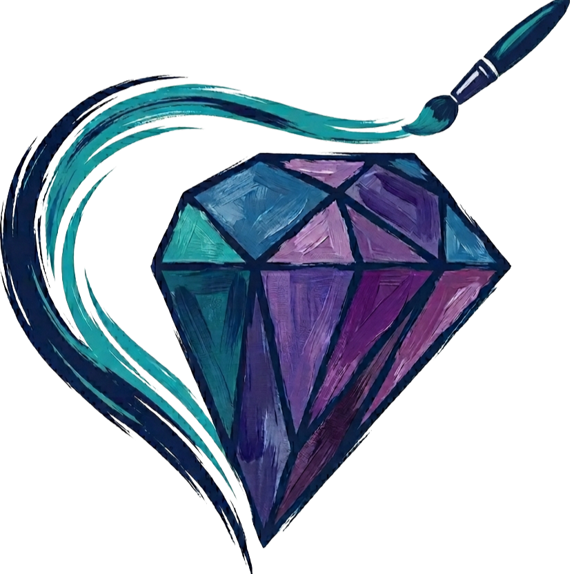
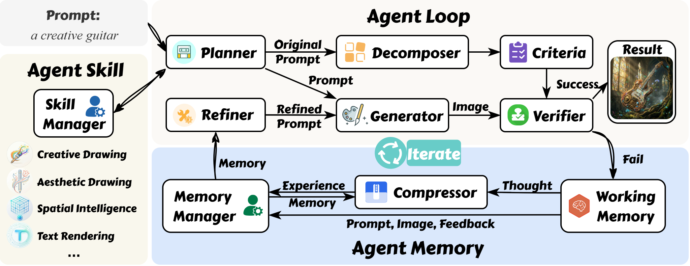

<div align="center">


#  GEMS: Agent-Native Multimodal Generation with Memory and Skills

<a href="https://arxiv.org/abs/2603.28088"></a>&nbsp;&nbsp;<a href="https://gems-gen.github.io"></a>&nbsp;&nbsp;
<a href="https://huggingface.co/papers/2603.28088"></a>




</div>


### Project Overview


```text
GEMS/
├── agent/
│   ├── server/                 # start server
│   │   ├── kimi.sh             # Kimi-K2.5
│   │   ├── qwen_image.py       # Qwen-Image-2512
│   │   └── z_image.py          # Z-Image-Turbo
│   ├── skills/
│   │   ├── aesthetic_drawing
│   │   │   └── SKILL.md
│   │   ├── creative_drawing
│   │   │   └── SKILL.md
│   │   └── ...
│   ├── base_agent.py           # base Interfaces
│   └── GEMS.py                 # core implementation
├── eval/                       # evalation for tasks
│   ├── ArtiMuse/
│   ├── CREA/
│   ├── GenEval2.py
│   └── ...
└── ...
```


### Quick Start
```
git clone https://github.com/lcqysl/GEMS.git
cd GEMS
pip install requests openai torch tqdm
```

### Start Server
We use [Kimi-K2.5](https://huggingface.co/moonshotai/Kimi-K2.5) as the MLLM and [Z-Image-Turbo](https://huggingface.co/Tongyi-MAI/Z-Image-Turbo) / [Qwen-Image-2512](https://huggingface.co/Qwen/Qwen-Image-2512) as the Generator. 
We use Sglang to serve MLLM and Diffusers to serve the Generator.

If using our configuration:
```
# For MLLM (Sglang)
pip install sglang

# For Generator (Diffusers + API)
pip install torch diffusers transformers fastapi uvicorn
```
Alternatively, you can use your own MLLM or Generator as a server.


### Infer
```
python infer.py
```

### Evaluation
Following the multimodal generation evaluation protocol, images are first generated based on task prompts and then scored using corresponding methods. We use **GenEval2** to demonstrate how to generate images with GEMS:

```bash
python eval/GenEval2.py
```

**Note:** Occasional server errors (e.g., timeouts or MLLM crashes) may result in missing outputs for a few tasks. Simply re-run the script to automatically complete the unfinished parts.

We provide full evaluation code for **CREA** and **ArtiMuse**. For other tasks, evaluations are conducted strictly following their official settings.


### Skills


Our Skills are summarized from previous works and tested on downstream tasks. You can also add your own by referring to `agent/skills`.

Each skill should be organized as follows:

```text
agent/skills/
└── <skill_id>/             # Unique folder name (used as Skill ID)
    └── SKILL.md            # Skill definition file
```
The `SkillManager` parses `SKILL.md` using regular expressions. To ensure your skill is recognized correctly, please follow this template:

```markdown
# Skill: <Name>

## Description
Provide a concise summary of what this skill does. 

## Instructions
Provide detailed domain-specific guidance, prompts, or constraints here. 
The code will capture all content remaining below this header.
```

### Citation
If you find our work useful, please consider citing:
```code
@article{he2026gems,
  title={GEMS: Agent-Native Multimodal Generation with Memory and Skills},
  author={He, Zefeng and Huang, Siyuan and Qu, Xiaoye and Li, Yafu and Zhu, Tong and Cheng, Yu and Yang, Yang},
  journal={arXiv preprint arXiv:2603.28088},
  year={2026}
}
```